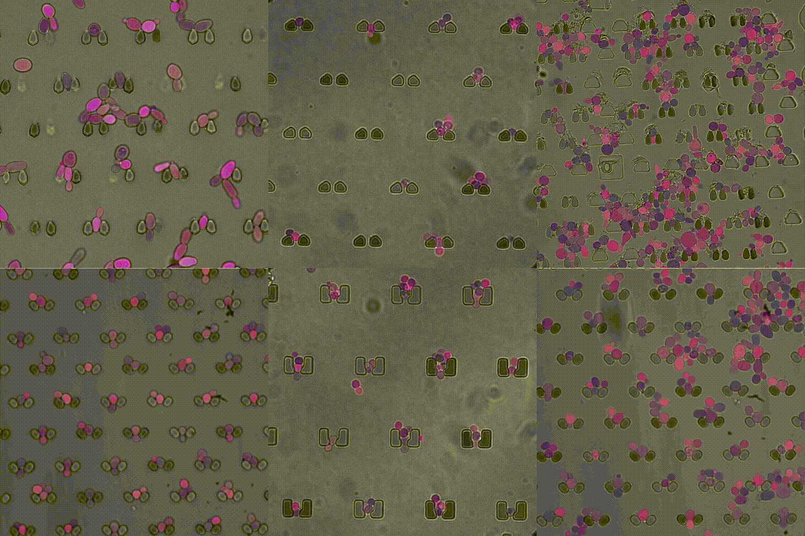

# The TYC Dataset for Understanding Instance-Level Semantics and Motions of Cells in Microstructures

[](https://arxiv.org/abs/2308.12116)
[](https://creativecommons.org/licenses/by/4.0/)
[](https://pytorch.org/)

**[Christoph Reich](https://christophreich1996.github.io)
, [Tim Prangemeier](https://scholar.google.com/citations?user=Ut23u2YAAAAJ&hl=en)
& [Heinz Koeppl](https://www.bcs.tu-darmstadt.de/team_sos/koepplheinz_sos.en.jsp)**<br/>

## | [Project Page](https://christophreich1996.github.io/tyc_dataset/) | [Paper](https://arxiv.org/abs/2308.12116) |  [Download Dataset](https://tudatalib.ulb.tu-darmstadt.de/handle/tudatalib/3930) |

<p align="center">
  
</p>

<p align="center">
  This repository includes the <b>official</b> and <b>maintained</b> <a href="https://pytorch.org/">PyTorch</a> <b>validation</b> (+ data loading & visualization) code of the TYC dataset proposed in <a href="https://arxiv.org">The TYC Dataset for Understanding Instance-Level Semantics and Motions of Cells in Microstructures</a>.
</p>

```
# Download labeled set
wget https://tudatalib.ulb.tu-darmstadt.de/bitstream/handle/tudatalib/3930/labeled_set.zip
# Download unlabeled set
wget https://tudatalib.ulb.tu-darmstadt.de/bitstream/handle/tudatalib/3930/unlabeled_set_1.zip
wget https://tudatalib.ulb.tu-darmstadt.de/bitstream/handle/tudatalib/3930/unlabeled_set_2.zip
wget https://tudatalib.ulb.tu-darmstadt.de/bitstream/handle/tudatalib/3930/unlabeled_set_3.zip
# Unzip files
unzip labeled_set.zip
unzip unlabeled_set_1.zip
unzip unlabeled_set_2.zip
unzip unlabeled_set_3.zip
```

## Abstract

*Segmenting cells and tracking their motion over time is a common task in biomedical applications. However, predicting
accurate instance-wise segmentation and cell motions from microscopy imagery remains a challenging task. Using
microstructured environments for analyzing single cells in a constant flow of media adds additional complexity. While
large-scale labeled microscopy datasets are available, we are not aware of any large-scale dataset, including both cells
and microstructures. In this paper, we introduce the trapped yeast cell (TYC) dataset, a novel dataset for understanding
instance-level semantics and motions of cells in microstructures. We release 105 dense annotated high-resolution
brightfield microscopy images, including about 19k instance masks. We also release 261 curated video clips composed of
1293 high-resolution microscopy images to facilitate unsupervised understanding of cell motions and morphology. TYC
offers ten times more instance annotations than the previously largest dataset, including cells and microstructures. Our
effort also exceeds previous attempts in terms of microstructure variability, resolution, complexity, and capturing
device (microscopy) variability. We facilitate a unified comparison on our novel dataset by introducing a standardized
evaluation strategy. TYC and evaluation code are publicly available under CC BY 4.0 license.*

**If you use our dataset or find this research useful in your work, please cite both of our papers:**

```bibtex
@inproceedings{Reich2023b,
    title={{The TYC Dataset for Understanding Instance-Level Semantics and Motions of Cells in Microstructures}},
    author={Reich, Christoph and Prangemeier, Tim and Koeppl, Heinz},
    booktitle={{IEEE/CVF International Conference on Computer Vision Workshops (ICCVW)}},
    year={2023}
}

@inproceedings{Reich2023a,
        title={{An Instance Segmentation Dataset of Yeast Cells in Microstructures}},
        author={Reich, Christoph and Prangemeier, Tim and Fran{\c{c}}ani, Andr{\'e} O and Koeppl, Heinz},
        booktitle={{International Conference of the IEEE Engineering in Medicine and Biology Society (EMBC)}},
        year={2023}
}
```

## Table of Contents

1. [Installation](#installation)
2. [Dataformat](#dataformat)
3. [Dataset Class](#dataset-class)
4. [Evaluation](#evaluation)
5. [Visualization](#visualization)
6. [Unlabeled Data](#unlabeled-data)
7. [Dataset Statistics](#dataset-statistics)
8. [Acknowledgements](#acknowledgements)

## Installation

The validation, data loading, and visualization code can be installed as a Python package by running:

```shell script
pip install git+https://github.com/ChristophReich1996/TYC-Dataset.git
```

All dependencies are listed in [requirements.txt](requirements.txt).

## Dataformat

The dataset is split into a training, validation, and test set. Please refer to the paper for more information on this.

```
├── labeled_set
│         ├── test
│         │   ├── images
│         │   └── labels
|         |     ├── classes
│         |     └── masks
│         ├── test_ood
│         │   ├── images
│         │   └── labels
|         |     ├── classes
│         |     └── masks
│         ├── train
│         │   ├── images
│         │   └── labels
|         |     ├── classes
│         |     └── masks
│         └── val
│             ├── images
│             └── labels
|               ├── classes
│               └── masks
|
└── unlabeled_set
    ├── 100x_10BF_200EGFP18_9Z_17P_120t_10s_050nM_1
    ├── 100x_10BF_200GFP_9Z_120t_10s_13P_005nM_2
    ├── 2018-02-13_AH_T2C_AH_T2C_60x__2
    ├── 2018-02-13_AH_T2C_AH_T2C_60x__4
    ├── 20211015
    ├── 20211104
    ├── 60x_10BF_200GFP_200RFP20_3Z_10min_3
    ├── BCS_Data-master_Additional_Data_Z_Project_BCS
    └── SegmentationPaperDeposit
```

Every subset (train, val, test, and test ood) of the labeled set includes a folder holding the images and labels. The
images entail a resolution of 2048x2048 or larger and are directly located in the images folder. The labels folder
contains two folders (classes and masks). The classes folder holds the semantic class labels of the object instances for
each image as a separate JSON file. The mask folder holds an image including the instance masks for each micorcopy
image. The resolution of the mask image is the same as that of the microcopy image.

The unlabeled set holds different folders for each experiment (e.g., 20211015). Each experiment folder holds multiple
folders indicating the position of the video clips. Each position folder holds a folder indicating the focal position.
The focal position folders hold the video clip itself as a sequence of TIFF images.

For details on the data loading please have a look at the [dataset class implementation](tyc_dataset/data/dataset.py).

## Dataset Class<a name="dataset-class" />

This repo includes a PyTorch dataset class implementation (in the `tyc_dataset.data` module) for the **labeled** TYC
dataset, located in the module `tyc_dataset.data`. The dataset class implementation loads the dataset and returns the
images, instance maps, bounding boxes, and semantic classes.

```python
import tyc_dataset
from torch import Tensor
from torch.utils.data import Dataset

# Init dataset
dataset: Dataset = tyc_dataset.data.TYCDataset(path="/some_path_to_data/train")
# Get first sample of the dataset
image, instances, class_labels = dataset[0]  # type: Tensor, Tensor, Tensor
# Show shapes
print(image.shape)  # [1, H, W]
print(instances.shape)  # [N, H, W]
print(class_labels)  # [N, C=2 (trap=0 and cell=1)]
```

The dataset class implementation also offers support for
custom [Kornia data augmentations](https://kornia.readthedocs.io/en/latest/applications/image_augmentations.html). You
can pass an [AugmentationSequential](https://kornia.readthedocs.io/en/latest/augmentation.container.html) object to the
dataset class. The following example utilizes random horizontal and vertical flipping as well as random Gaussian blur
augmentations.

```python
import kornia.augmentation
import tyc_dataset
from torch.utils.data import Dataset

# Init augmentations
augmentations = kornia.augmentation.AugmentationSequential(
    kornia.augmentation.RandomHorizontalFlip(p=0.5),
    kornia.augmentation.RandomVerticalFlip(p=0.5),
    kornia.augmentation.RandomGaussianBlur(kernel_size=(31, 31), sigma=(9, 9), p=0.5),
    data_keys=["input", "mask"],
    same_on_batch=False,
)
# Init dataset
dataset: Dataset = tyc_dataset.data.TYCDataset(path="/some_path_to_data/train", augmentations=augmentations)
```

**Note that it is necessary to pass `["input", "mask"]` as data keys!** If a different data key configuration is given a
runtime error is raised.

For wrapping the dataset with the PyTorch DataLoader please use
the [custom collide function](tyc_dataset/data/dataset.py).

```python
from typing import List

import tyc_dataset
from torch import Tensor
from torch.utils.data import Dataset, DataLoader

# Init dataset
dataset: Dataset = tyc_dataset.data.TYCDataset(path="/some_path_to_data/train")
data_loader = DataLoader(
    dataset=dataset,
    num_workers=2,
    batch_size=2,
    drop_last=True,
    collate_fn=tyc_dataset.data.collate_function_tyc_dataset,
)
# Get a sample from dataloader
images, instances, class_labels = next(
    iter(data_loader))  # type: List[Tensor], List[Tensor], List[Tensor]
```

<details>
  <summary>All Dataset Class Parameters</summary>

[TYCDataset](tyc_dataset/data/dataset.py) parameters:

| Parameter                                            | Default value                   | Info                                                               |
|------------------------------------------------------|---------------------------------|--------------------------------------------------------------------|
| `path: str`                                          | -                               | Path to dataset as a string.                                       |
| `augmentations: Optional[AugmentationSequential]`    | `None`                          | Augmentations to be used. If `None` no augmentation is employed.   |

</details>

We provide a full dataset and data loader example in [`example_eval.py`](example_data.py).

If this dataset class implementation is not sufficient for your application please customize the existing code or open a
pull request with extending the existing implementation.

## Evaluation

We propose to validate segmentation predictions on our dataset by using
the [Panoptic Quality](https://arxiv.org/abs/1801.00868) and the cell class IoU. We implement both metrics as a
TorchMetrics metric in the `tyc_dataset.eval` module. Both metrics ([PanopticQuality](tyc_dataset/eval/pq.py)
and [CellIoU](tyc_dataset/eval/cell_iou.py)) can be used like all TorchMetrics metrics. The input to both metrics is the
prediction, composed of the instance maps (list of tensors) and semantic class prediction (list of tensors), and the
label is also composed of instance maps and semantic classes. Note that the instance maps are not allowed to overlap.
Additionally, both metrics assume thresholded instance maps and hard semantic classes (no logits).

**Note currently only a batch size of 1 is supported during validation!**

```python
import tyc_dataset
from torchmetrics import Metric

pq: Metric = tyc_dataset.eval.PanopticQuality()
cell_iou: Metric = tyc_dataset.eval.CellIoU()

for index, (images, instances, bounding_boxes, class_labels) in enumerate(data_loader):
    # Make prediction
    instances_pred, class_labels_pred = model(
        images)  # type: List[Tensor], List[Tensor], List[Tensor]
    # Get semantic classes form one-hot vector
    class_labels = [c.argmax(dim=-1) for c in class_labels]
    class_labels_pred = [c.argmax(dim=-1) for c in class_labels_pred]
    # Compute metrics
    pq.update(
        instances_pred=instances_pred,
        classes_pred=class_labels_pred,
        instances_target=instances,
        classes_target=class_labels,
    )
    cell_iou.update(
        instances_pred=instances_pred,
        classes_pred=class_labels_pred,
        instances_target=instances,
        classes_target=class_labels,
    )
# Compute final metric
print(f"Panoptic Quality: {pq.compute().item()}")
print(f"Cell class IoU: {cell_iou.compute().item()}")
```

A full working example is provided in [`example_eval.py`](example_eval.py).

## Visualization

This implementation (`tyc_dataset.vis` module) also includes various functions for reproducing the plots from the paper.
The instance segmentation overlay (image + instance maps + classes), as shown at the top, can be achieved by:

```python
import tyc_dataset
from torch import Tensor
from torch.utils.data import Dataset

# Init dataset
dataset: Dataset = tyc_dataset.data.TYCDataset(path="/some_path_to_data/train")
# Get first sample of the dataset
image, instances, class_labels = dataset[0]  # type: Tensor, Tensor, Tensor
# Plot 
tyc_dataset.vis.plot_image_instances(
    image=image,
    instances=instances,
    class_labels=class_labels.argmax(dim=1) + 1,
    save=True,
    show=True,
    file_path="plot_instance_seg_overlay.png",
)

```

All plot functions entail the parameter `show: bool` and `save: bool`. If `show=True` the plot is directly visualized by
calling `plt.show()`. If you want to save the plot to a file set `save=True` and provide the path and file
name (`file_path: str`).

An example use of all visualization functions is provided in [`example_vis.py`](example_vis.py).

## Unlabeled Data

Due to the vastly different usage of our unlabeled video clips, we don't provide a dataset class implementation.
However, you can load the individual frames of the provided video clips by using `cv2.imread(path_to_image, -1)`. Note
that currently [torchvision](https://pytorch.org/vision/stable/index.html) does not support loading 16-bit TIFF image.
For details on the dataformat of the unlabeled set please refer to the dataformat section.

## Dataset Statistics

We do not normalize the loaded images in the provided dataset classes. If you want to normalize the images you might
find the following statistics helpful. Note that all images are provided (and loaded) in the raw 16-bit TIFF format.

| Dataset       | Mean      | Std      |
|---------------|-----------|----------|
| Labeled set   | 4818.1709 | 685.2440 |
| Unlabeled set | 6208.7651 | 949.4420 |
| Full dataset  | 6104.3213 | 929.5987 |

## Acknowledgements

We thank [Bastian Alt](https://scholar.google.de/citations?user=ZEj8FekAAAAJ&hl=en) for insightful
feedback, [Klaus-Dieter Voss](https://www.bcs.tu-darmstadt.de/team_sos/mitarbeiterliste_sos.en.jsp) for aid with the
microfluidics fabrication, [Markus Baier](https://www.bcs.tu-darmstadt.de/team_sos/mitarbeiterliste_sos.en.jsp) for help
with the data hosting, and [Aigerim Khairullina](https://www.linkedin.com/in/aigerim-khairullina-9448b5141/) for
contributing to data labeling.

Credit to [TorchMetrics](https://github.com/Lightning-AI/torchmetrics) (Lightning AI)
, [Kornia](https://github.com/kornia/kornia), and [PyTorch](https://github.com/pytorch/pytorch) for providing the basis
of this implementation.

This work was supported by the Landesoffensive für wissenschaftliche Exzellenz as part of the LOEWE Schwerpunkt
CompuGene. H.K. acknowledges the support from the European Research Council (ERC) with the consolidator grant CONSYN (
nr. 773196). C.R. acknowledges the support of NEC Laboratories America, Inc.
